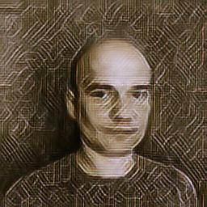

# Project 4. Style Transfer on Mobile
## About
This project is implemented with [Magenta](https://github.com/magenta/magenta/tree/main/magenta/models/arbitrary_image_stylization) framework (Tensorflow based) by Aleh Kholeu (Oleg Kholev).

## Objectives
* create a working prototype of style transfer model
* build a mobile application for the trained model and present its functionality

## Files
[Training notebook](Project4.ipynb)

[Training results](training/)

[Mobile app source](android/)

[Trained mobile models](android/app/src/main/assets/)

[Video recording of mobile app start and image processing](tflite_style_transfer.mp4)

## Model Training
Creating Jupyter notebook in Google Colab for Magenta was challenging task as this project is not maintained anymore and cannot be run with the latest Python versions. In order to use it Conda environment was downgraded to Python 3.7, other versions may be supported too.

Initially the training was executed in 10000 steps and loss function graphs for both models (train_dir and train_mobile) are present below:

Mobile model performed worse compare to conventional one. So it was trained for next extra 20k steps.

## Results
Two model sets were successfully trained:

* Style prediction networks (InceptionV3 for non-mobile use and MobileNetV2 for mobile app): converts the style image to a style embedding vector
* Style transform network (VGG-16): applies the style embedding vector on the content image to generate a stylized image

Non-mobile inference examples are present below:

<table cellspacing="0" cellpadding="0" border-spacing="0">
<tr>
<th>style image</th>
<th>w=0.0</th>
<th>w=0.2</th>
<th>w=0.4</th>
<th>w=0.6</th>
<th>w=0.8</th>
<th>w=1.0</th>
</tr>
<tr>
<th></th>
<th></th>
<th></th>
<th></th>
<th></th>
<th></th>
<th></th>
</tr>
<tr>
<th></th>
<th></th>
<th></th>
<th></th>
<th></th>
<th></th>
<th></th>
</tr>
<tr>
<th></th>
<th></th>
<th></th>
<th></th>
<th></th>
<th></th>
<th></th>
</tr>
<tr>
<th></th>
<th></th>
<th></th>
<th></th>
<th></th>
<th></th>
<th></th>
</tr>
<tr>
<th></th>
<th></th>
<th></th>
<th></th>
<th></th>
<th></th>
<th></th>
</tr>
<tr>
<th></th>
<th></th>
<th></th>
<th></th>
<th></th>
<th></th>
<th></th>
</tr>
</table>

Mobile app usage is present in this [video](tflite_style_transfer.mp4)
